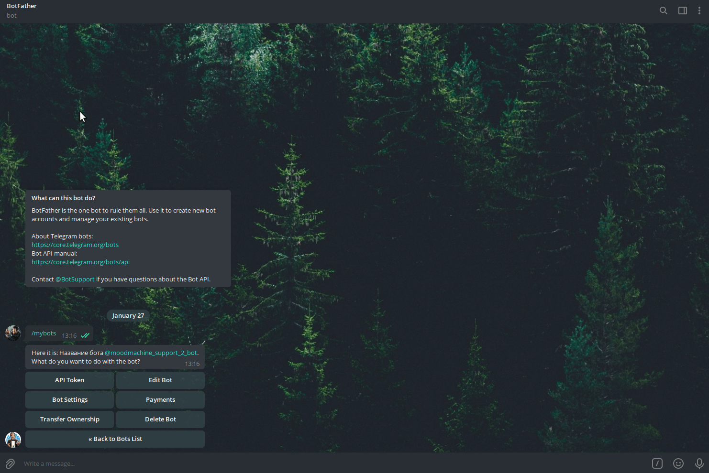
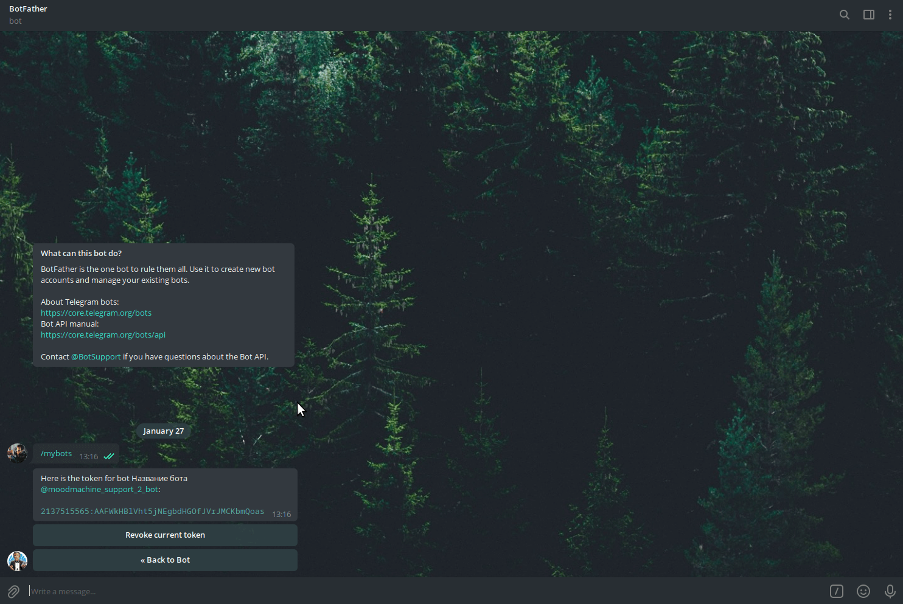
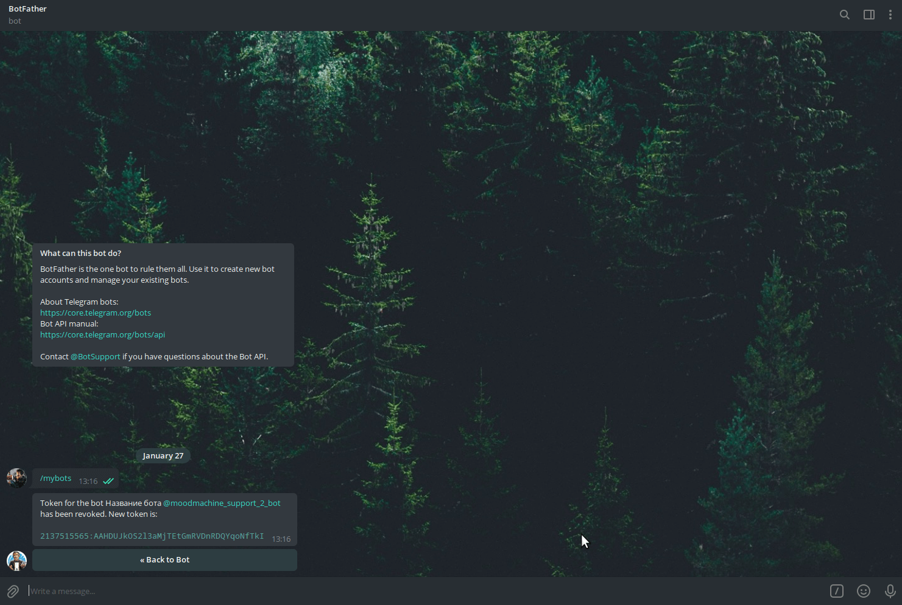

## Как сбросить токен

### Ищем своего бота

Сперва, необходимо найти своего бота из списка уже созданных раннее в [BotFather](https://t.me/BotFather). Для этого
вводим команду **/mybots** и в списке ботов выбираем нужного.

### Сброс токена

Теперь выбрать раздел **API Token** и далее выбрать **Revoke Current Token**. Таким образом у нас сбросится токен, и вы
увидите сообщение в формате:
> Token for the bot Название бота @moodmachine_support_2_bot has been revoked. New token is:
>
>2137515565:AAHDUJkOS2l3aMjTEtGmRVDnRDQYqoNfTkI

В данном сообщении вместо **@moodmachine_support_2_bot** будет юзернейм вашего бота, а вместо **2137515565:
AAHDUJkOS2l3aMjTEtGmRVDnRDQYqoNfTkI**, ваш новый токен.

### Настройка бота

Если вам необходима расширенная настройка бота, включая изображение бота, описание и список доступных команд, то
рекомендуем наше [руководство по расширенной настройке бота](/bots/rashirennaya-nastroika-bota)
