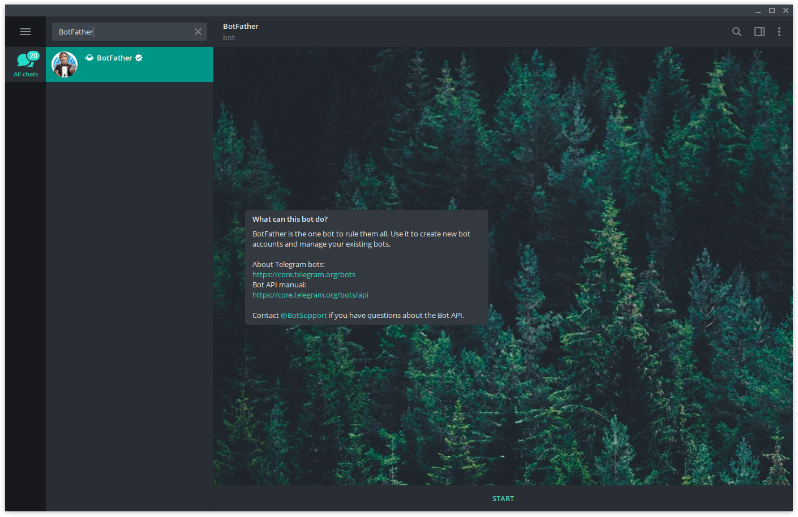
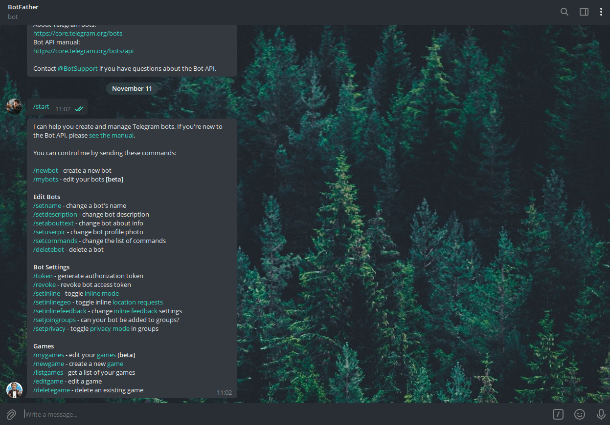
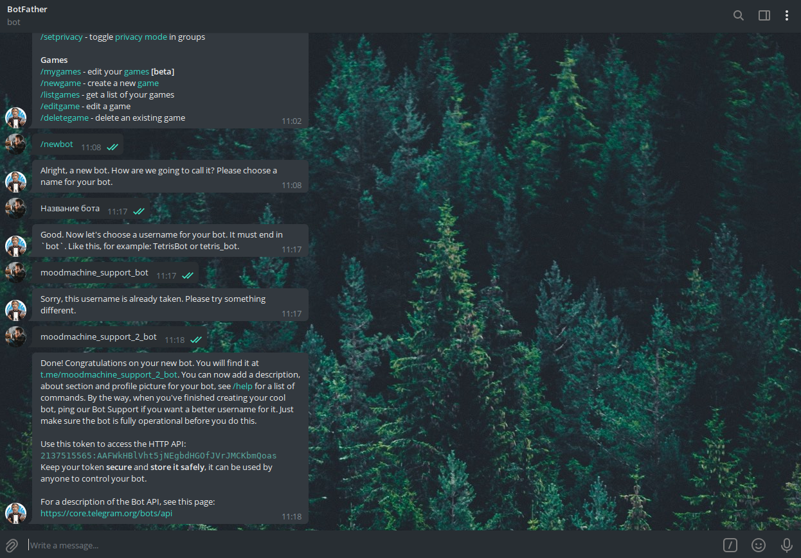

## Создание простейшего бота

Чтобы создать своего бота в телеграм, необходимо сперва найти бота для создания ботов
— [BotFather](https://t.me/BotFather)

Находим бота, нажимаем кнопку **START**

Бот отправляет нам список доступных команд. Нам нужна команда **/newbot**. Нажимаем на нее, в отправленном ботом
сообщении, либо же самостоятельно пишем и отправляем боту.

### Имя бота

Сразу же после ввода команды **/newbot**, [BotFather](https://t.me/BotFather) попросит нас ввести имя нашего бота.

> Alright, a new bot. How are we going to call it? Please choose a name for your bot.

Имя можно выбрать любое, ограничений нет. Позже его можно будет поменять

### Юзернейм бота

После установки имени бота, необходимо выбрать юзернейм бота, который будет содержать только английские буквы, знаки "-"
, "_" и будет заканчиваться на **bot**

> Good. Now let's choose a username for your bot. It must end in \`bot\`. Like this, for example: TetrisBot or tetris_bot.

Если юзернейм будет занят, то бот сообщит об этом

> Sorry, this username is already taken. Please try something different.

## Завершение создания простейшего бота

После того как вы указали имя и юзернейм бота, [BotFather](https://t.me/BotFather) отправит сообщение об удачном
создании бота

> Done! Congratulations on your new bot. You will find it at **t.me/moodmachine_support_2_bot**. You can now add a
> description, about section and profile picture for your bot, see /help for a list of commands. By the way, when you've
> finished creating your cool bot, ping our Bot Support if you want a better username for it. Just make sure the bot is
> fully operational before you do this.
>
> Use this token to access the HTTP API:
> **2137515565:AAFWkHBlVht5jNEgbdHGOfJVrJMCKbmQoas**
> Keep your token secure and store it safely, it can be used by anyone to control your bot.
>
> For a description of the Bot API, see this page: https://core.telegram.org/bots/api

В этом же сообщении есть токен бота. Например, в данном случае это **2137515565:AAFWkHBlVht5jNEgbdHGOfJVrJMCKbmQoas**

Токен используется для отправки сообщений, принятия сообщений и любых других манипуляций с ботом вне диалога с
[BotFather](https://t.me/BotFather).

Будьте осторожны и не сообщайте токен сторонним людям. Однако, если же это произошло, ознакомьтесь
с [нашим руководством по сбросу токена](/bots/kak-sbrosit-token)

## Расширенная настройка бота

Если вам необходимо выбрать изображение бота, описание и список команд, можете ознакомиться
с [нашим руководством по расширенной настройке бота](/bots/rashirennaya-nastroika-bota)