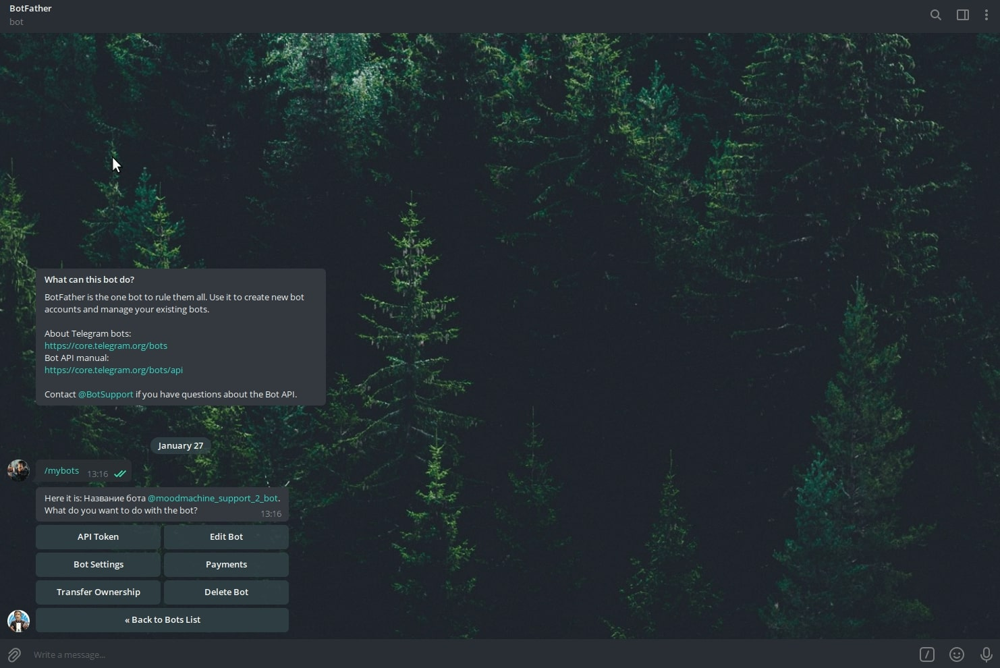
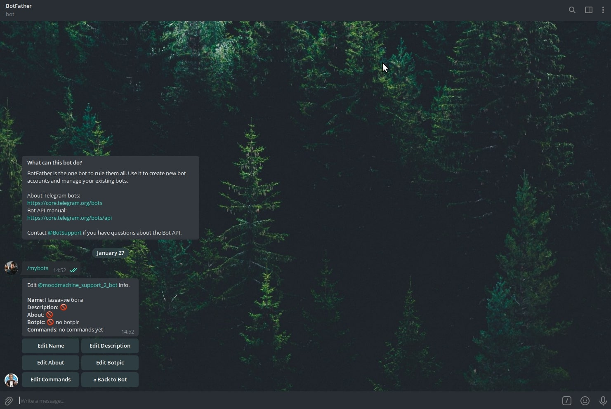
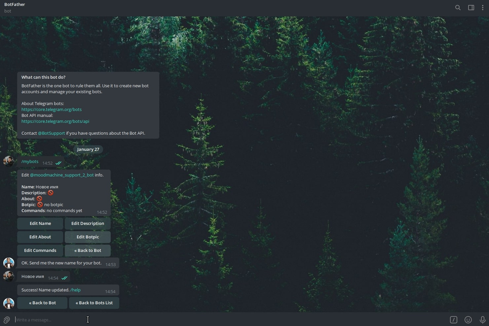
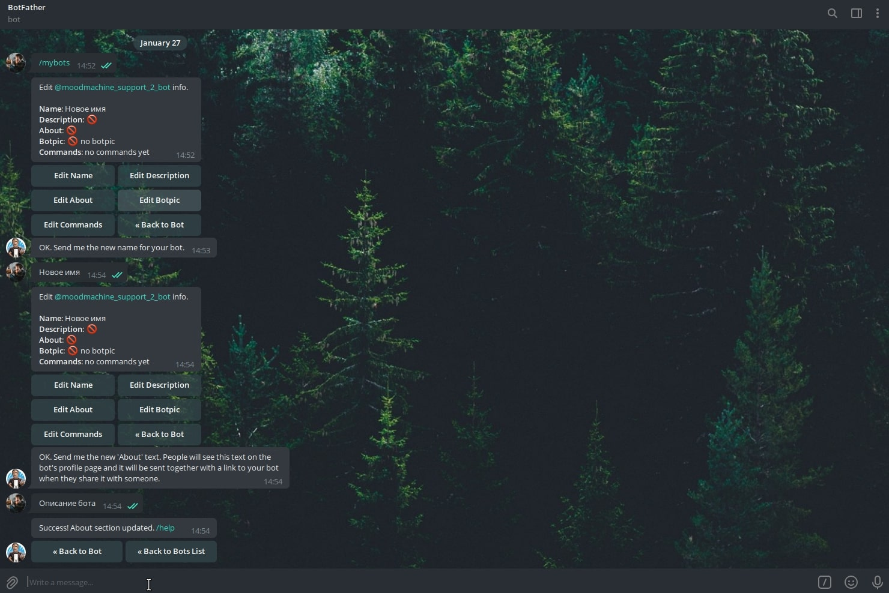
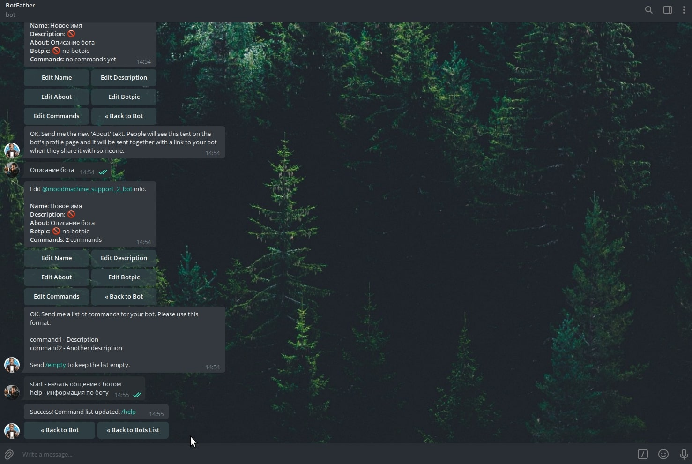
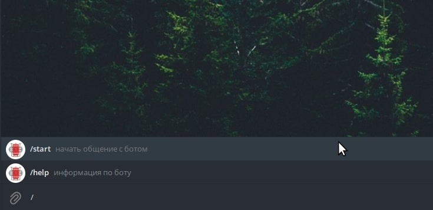
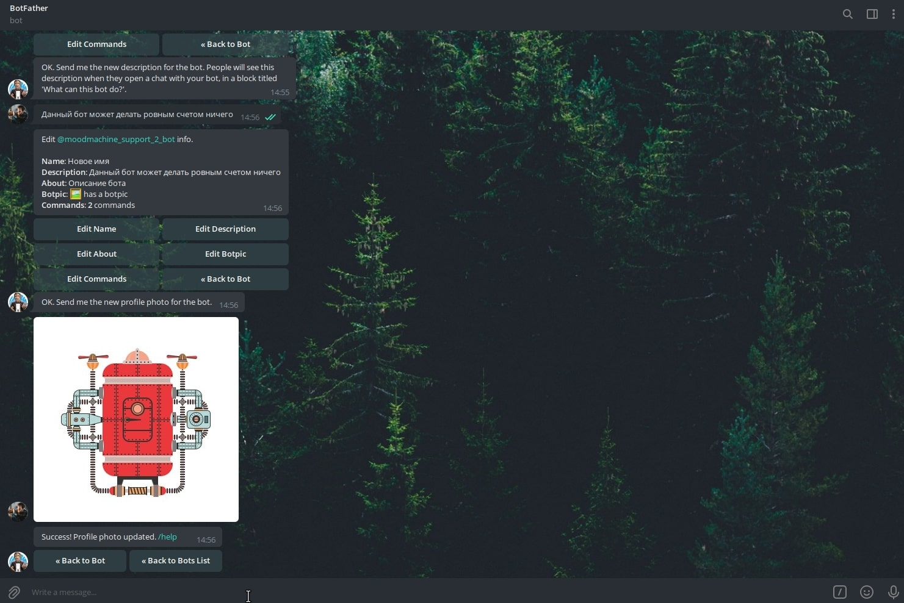
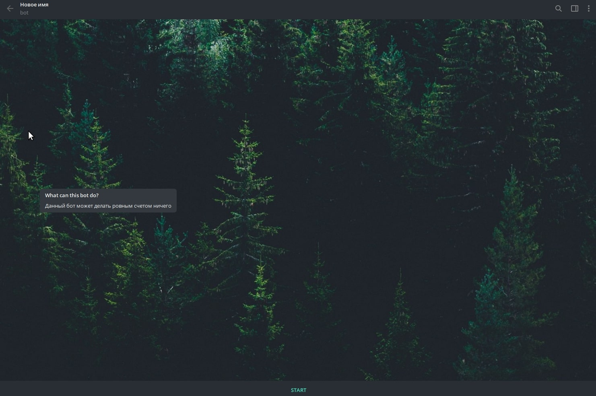
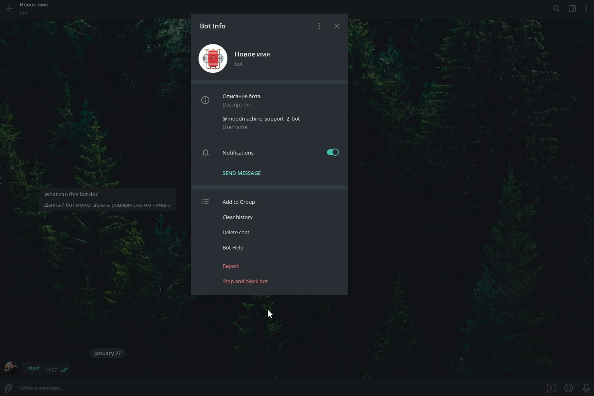

Прежде чем начать редактировать нашего бота, необходимо найти его в списке ботов в [BotFather](https://t.me/BotFather).
Для этого вводим команду **/mybots** и в списке ботов выбираем нужного.

## Базовые настройки

Чтобы начать редактировать бота, необходимо нажать кнопку **Edit Bot**. Далее перед вами будет окно редактирования бота.

В этом окне есть следующие пункты:

1. **Edit Name** - редактирование имени бота, которое будет отображаться в списке контактов
2. **Edit About** - редактирование описание бота в его профиле
3. **Edit Commands** - редактирование списка команд, которые будут отображаться пользователю в диалоге с ботом
4. **Edit Description** - редактирование текст в блоке "What this bot can do"/"Что умеет этот бот", который появляется
   при первом открытии чата с ботом
5. **Edit Botpic** - редактирование изображения бота
6. **Back to Bot** - возрат к предыдущему меню

### Имя бота

Чтобы поменять имя бота, которое отображается в списке контактов, необходимо нажать кнопку **Edit Name**. После чего бот
попросит ввести новое имя:
> OK. Send me the new name for your bot.

Имя может содержать любые символы. Вводим его, и если все хорошо, [BotFather](https://t.me/BotFather) сообщает нам об
успешной смене имени.

Теперь необходимо нажать **Back to Bot**, чтобы вернуться в профиль нашего бота. Затем, необходимо нажать **Edit Bot**,
чтобы продолжить редактирование бота.

### Описание в профиле бота

Теперь, когда мы можем поменять описание бота в профиле. Для этого нажимаем **Edit About**, и по аналогии с именем,
меняем описаниею

## Расширенные настройки бота

Теперь же, когда мы настроили базовые настройки бота, можно перейти к расширенным настройкам.

### Предпросмотр команд бота

Сперва, изменим список команд, который будет отображаться пользователю в чате. Выбираем в меню редактирования бота,
пункт **Edit Commands** и бот предлагает нам ввести комманды в формате:
> команда - описание
>
> команда2 - другое описание
>
> Если необходимо оставить список пустым, отправьте **/empty**

Если нам необходимо добавить команды, то отправляем их все боту в указаном формате. Если же нам необходимо очистить
список команд, отправляем боту команду **/empty**.

Теперь в чате с ботом, пользователям будет доступен список указанных команд.

### Описание бота при начале диалога

Когда мы только заходим в бота, у нас появляется сообщение в котором описывается что умеет бот.

Чтобы поменять это сообщение, необходимо перейти во вкладку **Edit Description** и ввести новое описание, подобно
описанию бота в профиле.

### Изображение бота

Чтобы поменять изображение бота, необходимо заранее подготовить квадратное изображение, которое мы отправим боту.
Нажимаем кнопку **Edit BotPic** и отправляем подготовленное изображение.

## Проверяем

Теперь, когда мы поменяли все настройки бота, переходим в самого бота и смотрим все ли заработало.

